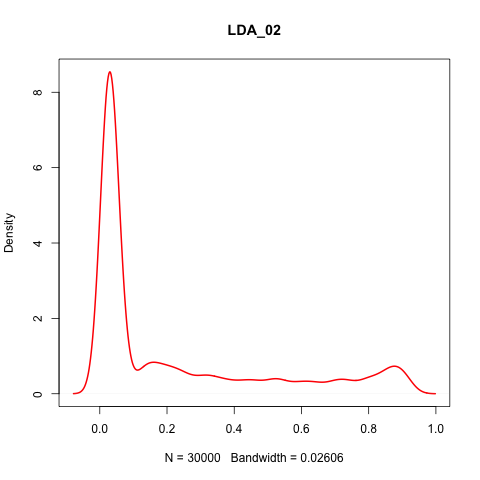
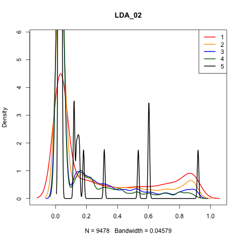
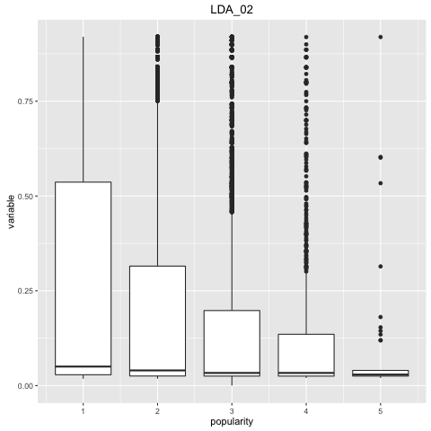

##The Unlikelies - Report on Kaggle Competition

###Data Preparation

Transformation of the features was carried out by visual inspection. We had three main plots to understand the behaviour of each variable: a density plot, a bivariate plot (density for the variable for each class) and a boxplot conditional on class.  All plots can be found in the `temp/summaries` folder on GitHub.  Here are a couple of examples:







These visual representations were also endorsed by a numerical summary of the variables, and a summary conditional on class.  For example:

```
VARIABLE: timedelta 
===================
* Summary:
   Min. 1st Qu.  Median    Mean 3rd Qu.    Max. 
    8.0   165.0   338.0   354.4   541.0   731.0 
* Cluster means:
       1        2        3        4        5 
346.0107 353.8435 369.0098 357.8498 344.4043 
* Cluster standard deviations:
       1        2        3        4        5 
211.9193 216.6832 210.2421 202.0282 190.4025 
* Cluster medians:
    1     2     3     4     5 
344.0 327.0 356.5 360.0 388.0
```


With this information we performed various transformations to the most interesting features:

- Logarithmic Transformations
- Standardization of features
- New dummy variables

Additionally, we added a new set of variables extracted from the URL, including:
- Day
- Month
- Year
- Season
- Average popularity per day
- Standard deviation of the popularity per day
- Total news per day

We also performed an initial screening of most promising variables. The final selection of the variables was performed using backward stepwise linear regression on popularity, plus the variables that we believed intuitively should stay in the model regardless.

We attempted to tokenize the titles, using the URLs as an approximation thereof.  Articles from the test set were given a score that corresponded to the average scores of the words as found in the titles of the training set.  This calculation did not appear to be correlated with our variable of interest and did not give any empirical advantage to our models.

We considered lags of the popularity of other known articles in aggregate.  Assuming that our training set was representative, we believed there could be some autocorrelation between the ambient level of popularity of news stories, i.e. the public’s attention to the news would be highly related to the attention the day before, either positively due to a general state of excitement, or negatively due to some sort of exhaustion of attention.  These measures did not appear to be correlated with our variable of interest and did not give any empirical advantage to our models.

A full list of the transformations can be found in the script `03_features.R`.

####Outlier Detection and Handling
All continuous variables were scanned for outliers.  We treated any value that was in the upper or lower 5% quantile for the distribution of that variable to be an outlier.  Any outlying value resulted in us considering the entire observation to be an outlier.  We did not eliminate the outliers, however.  We simply added a new binary feature called `is_outlier` and set it to 1 for those observations.  The reasoning behind this was that outliers are not too much of a problem for Random Forest in general, but it could be useful to allow Random Forest to branch on outliers in some situation. Also, most of the observations with high class (4s and 5s) were outliers for some features, so we decided not to eliminate them from the set.

###Models Investigated But Not Selected
####Support Vector Machine
We used the implementation of an SVM from the R package `e1071` with a radial kernel function and achieved a score of 52% correctness.

####Neural Networks
We used the implementation of a neural network from the R package `nnet` and achieved a score of 51% correctness.

####K-Nearest Neighbors
We used the implementation of KNN from the R package `class`.  We tried a wide range of values for ‘k’.  The best that the K-Nearest Neighbors approach gave us was a cross-validated score of 47% correctness.

####Adaptive Boosting
We used the implementation of Adaptive Boosting from the R package `maboost`. This method scored well, over 52%, but a bit shy of Random Forest.

####Multinomial Logit
We used the implementation of Multinomal Logit Regression from the `nnet` package.  At the time, we concluded it was not successful enough, and did not record a score.

####Linear Discriminant Analysis
We used the ‘lda’ function from the `MASS` package.  At the time, we concluded it was not successful enough, and did not record a score.

####Others 
Quick investigations of packages offering Ordinal Logistic Regression, Stochastic Gradient Descent, and Logistic Regression, but did not prove sufficiently successful.

###Final Model
####Random Forest
Our investigation of Random Forest, using the `randomForest` R package proved immediately more successful than the others.  With zero tuning, it put us on top of the public leaderboard and we remained there for a long time.  In fact, all attempts at tuning resulted in less good scores on the leaderboard.  However, we persisted with our tuning and other efforts as we were able to improve our internally cross-validated scores.

####Hyper-Parameter Tuning
We performed tuning on hyper-parameters on our Random Forest model.  Rather than using an out-of-the-box package for tuning, we wrote a small amount of R code to do it for us.  We looped over numerous values for `ntree` (number of trees in the forest), `nodesize` (minimum number of observations in a node), `mtry` (the number of variables randomly sampled at each split), `importance` (allowing the algorithm to assess the individual importance of each feature), and `corr.bias` (experimental).  Ultimately, we only selected to explicitly set ntree and nodesize.

###Advantages of the model
- Takes into account non-linearities, outliers and time data

###Pitfalls of the model
- Over predicting twos.
- Missing on fours and fives (too few and outlier observations)

###Ensemble Processing
A parallel effort which we developed under the expectation that it would be our best approach was an ensemble method.  It actually landed us in second position at the interim milestone and provided us our best internal cross-validated score.  However, when the final results were tallied, it was a simpler approach that prevailed.  For posterity's sake, this parallel effort is described below.

We performed our ensemble “post-processing” upon the results from the Random Forest model described in the previous section.  This was motivated by the fact that we could evaluate the votes that came from the trees in the forest, and could see that 83% of the time, the correct classification was either the first or second choice coming out of Random Forest.  We believed that if we focused on that 83% and treated it as a binary classification problem, we had a chance of doing better than the single-stage five-class problem.

In preparation for the binary classification problem, we split the training set into ten groups, those containing classes {1,2}, {1,3}, {1,4}, {1,5}, {2,3}, {2,4}, {2,5}, {3,4}, {3,5}, and {4,5}.  We then created Random Forest models for each of these pairs.  When the original model predicted a 3 as the most likely classification, and a 2 as the second most likely, we then did a subsequent predication against the {3,4} model.

Given that the original Random Forest was still correct more than it was incorrect, even within the 83% where one of the top two choices is correct, we cannot look at this second stage as a tie-breaker.  We needed more information.  So we also ran a binary classification step using MaBoost.  A boosting algorithm was selected as we believed that giving greater weight to the difficult-to-classify observations could be beneficial on a dataset that seems to have a high degree of randomness built into it.  The output of all of these algorithms was then concatenated with the complete, original dataset, and a final Random Forest was run.  This allowed the Random Forest algorithm to consider the strengths and weaknesses of the different models, in the different classes, with respect to the values of the features.

The full procedure above was repeated 10 times, each time with a 50% training set and a 50% test set.  The 50% test set then became the training set for the final Random Forest model.  The splits were performed in a manner such that each row was in a training set 5 times and in a test set 5 times.  The result was 10 “meta models”, each of which contributed one vote when running true predictions.

####Steps for the Training Procedure

- Split the data set in ten approximately equal groups randomly.
- Ten times do the following:
-   Train a Random Forest model on three of the data groups as a single training set.
-   Test the model against the other seven data groups as a single test set.
-   Evaluate our predictions.
-   Run the appropriate binary Random Forest model and store the prediction.
-   Run the appropriate binary MaBoost model and store the prediction.
-   Run the appropriate binary GBM model and store the prediction.
- One time do the following:
-   Run a final Random Forest model on the test set (now a training set) along with the predictions, and where possible, the probabilities, from each model.

####Steps for the Predicting Procedure

Ten times do the following:
-   Predict using the 10 primary Random Forest models.
-   Predict using each of the 10 appropriate binary Random Forest models.
-   Predict using each of the 10 appropriate binary MaBoost models.
-   Predict using each of the 10 appropriate binary GBM models.
-   Combine all the above predictions and probabilities and concatenate to the feature set.
-   Predict using each of the 10 Random Forest meta models.
- One time do the following:
-   For each observation, take the mode of the predictions of the meta models, and use that as our final prediction.

####Conclusion

With enough development effort and tuning, the ensemble method may have been more successful.  However, its complexity and the time it took to run a test were its downfall.  Ultimately, variable selection, feature creation, and parameter tuning of a basic Random Forest implementation produced our best results. It is still improvable by finding solutions to avoid overpredicting twos, and especially to be able to spot viral arcticles, which random forest could not find.
